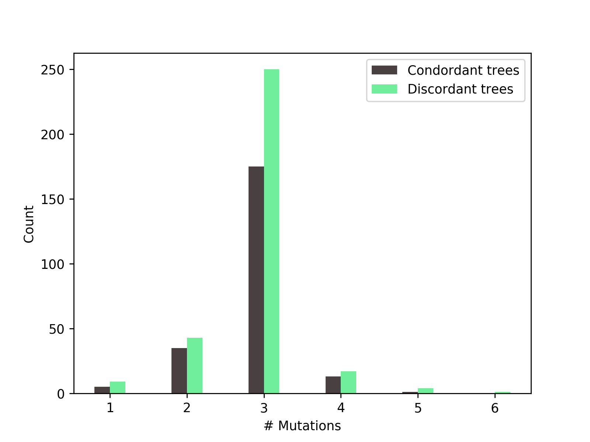

# HemiplasyTool


## Authors:
Matt Gibson (gibsomat@indiana.edu)  
Mark Hibbins (mhibbins@indiana.edu)

## Dependencies:
* [ms](http://home.uchicago.edu/~rhudson1/source.html)  
* [seq-gen](http://tree.bio.ed.ac.uk/software/seqgen/)
* biopython
* numpy
* matplotlib


## Installation

```
git clone https://github.com/mhibbins/hemiplasytool
cd hemiplasytool
python setup.py install
```


## Usage
```
usage: hemiplasytool [-h] [-v] [-n] [-x] [-p] [-g] [-s] [-o] splits

Tool for characterising hemiplasy given traits mapped onto a species tree

positional arguments:
  splits                Input file describing split times, trait pattern, and
                        topology

optional arguments:
  -h, --help            show this help message and exit
  -v, --verbose         Enable debugging messages to be displayed
  -n , --replicates     Number of replicates per batch
  -x , --batches        Number of batches
  -p , --mspath         Path to ms
  -g , --seqgenpath     Path to seq-gen
  -s , --mutationrate   Seq-gen mutation rate (default 0.05)
  -o , --outputdir      Output directory
```

## Input file

The input file has three sections:  split times, traits, and species tree. They must be specified in this order and delimited by a '#'. See below for descriptions of each section

```
#splits
6   2   1
3   3   2
1.5 5   3
1.25    6   5
1   4   3

#traits
1   0 
2   1
3   0
4   1
5   0
6   1

#tree
(1,(2,((6,5),(4,3))));

#introgression (time, source, dest, probability; optional)
0.25    3   2   0.1
0.5 5   6   0.1

```

### Split times

The split times describe the order of subpopulation splits to `ms`. Each line specifies the timing (in 4N generations), source population, and destination population (backwards in time). Splits should be ordered oldest to newest. Entries should be delimited by spaces or tabs


### Traits

The traits section describes the observed species trait pattern. Each line specifies the taxa ID (must correspond to those coded in the split times file), the binary trait value, and the timing of sampling (in 4N generations relative to the longest branch). These can be specified in any order


### Species tree

The species tree in Newick format. Again, taxa IDs must correspond to those in the split times and traits sections.

### Introgression

Introgression events. Each line should specify the timing (in 4N generations), source taxon, destination taxon, and probability of introgression. Events can be specified in any order.

## Example:
```
python -m hemiplasytool -v -n 1000000 -p ~/bin/ms -g ~/bin/seq-gen -x 1 ./test/input_test_small.txt -o outtest.txt
```

### Output:
```
### INPUT SUMMARY ###

The species tree is (1,(2,((6,5),(4,3))));

  _______ 1
 |
_|        ________ 2*
 |       |
 |_______|                 ________ 6*
         |         _______|
         |        |       |________ 5
         |________|
                  |        ________ 4*
                  |_______|
                          |________ 3

3 taxa have the derived state: 2, 4, 6

The minimum number of mutations required to explain this trait pattern is 3

Introgression from taxon 3 into taxon 2 occurs at time 0.25 with probability 0.1
Introgression from taxon 5 into taxon 6 occurs at time 0.5 with probability 0.1


### OUTPUT SUMMARY ###

"True" hemiplasy (1 mutation) occurs 4 time(s)

Combinations of hemiplasy and homoplasy (1 < # mutations < 3) occur 19 time(s)

"True" homoplasy (>= 3 mutations) occurs 109 time(s)

99 loci have a discordant gene tree
33 loci are concordant with the species tree

20 loci originate from an introgressed history
112 loci originate from the species history

In cases with combinations of hemiplasy and homoplasy:

Taxon 2 mutated to the derived state 8 time(s), and inherited it from an ancestral population 11 time(s)
Taxon 4 mutated to the derived state 1 time(s), and inherited it from an ancestral population 18 time(s)
Taxon 6 mutated to the derived state 2 time(s), and inherited it from an ancestral population 17 time(s)

### DETAILED OUTPUT ###

On concordant trees:
# Mutations	# Trees
3		26
4		7

On discordant trees:
# Mutations	# Trees
1		4
2		19
3		66
4		5
5		5

Derived mutation inheritance patterns for trees with fewer mutations than derived taxa:
	Term	Inherited from anc node
Taxa 2	8	11
Taxa 4	1	18
Taxa 6	2	17

Of the replicates that follow species site pattern:
99 were discordant
33 were concordant

9 replicates matching the species pattern were from introgression tree 1
11 replicates matching the species pattern were from introgression tree 2
112 replicates matching the species pattern were from the species tree

### OBSERVED GENE TREES ###
...
```

See `outtest.txt` for full output.

