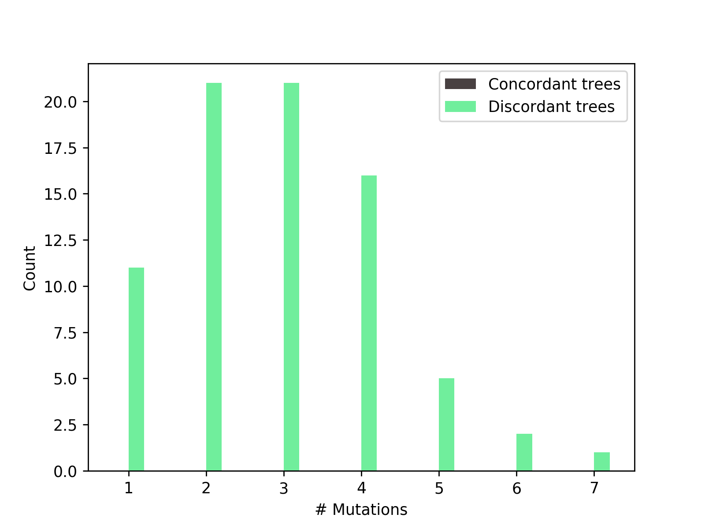

# HeIST
**He**miplasy **I**nference **S**imulation **T**ool


## Authors:
Matt Gibson (gibsomat@indiana.edu)  
Mark Hibbins (mhibbins@indiana.edu)

## Dependencies:
* [ms](http://home.uchicago.edu/~rhudson1/source.html)  
* [seq-gen](http://tree.bio.ed.ac.uk/software/seqgen/)
* biopython
* numpy
* matplotlib
* ete3


## Installation

```
git clone https://github.com/mhibbins/hemiplasytool
cd hemiplasytool
python setup.py install
```


## Usage
```
usage: __main__.py [-h] [-v] [-n] [-x] [-p] [-g] [-s] [-o] input

Tool for characterising hemiplasy given traits mapped onto a species tree

positional arguments:
  input                 Input NEXUS file

optional arguments:
  -h, --help            show this help message and exit
  -v, --verbose         Enable debugging messages to be displayed
  -n , --replicates     Number of replicates per batch
  -x , --batches        Number of batches
  -p , --mspath         Path to ms
  -g , --seqgenpath     Path to seq-gen
  -s , --mutationrate   Seq-gen mutation rate (default 0.05)
  -o , --outputdir      Output directory/prefix
```

## Input file

The input file is modified NEXUS format. A minimal example includes a tree (in newick format) and at least two dervived taxa set with the `set derived` command. If an outgroup is specified with `set outgroup`, the tree will be pruned to contain only taxa relevant to the simulation (i.e., the subclade containing derived taxa) + the outgroup. 

```
#NEXUS
begin trees;
tree tree_1 = (((Scincella_victoriana_CAS220628:0.0261231698,((((Lipinia_leptosoma_CAS248067:0.0135217139,((Sphenomorphus_darlingtoni_CCA02541:0.0053927675,((Sphenomorphus_jobiense_CCA17225:0.0034937879,(Sphenomorphus_mulleri_CCA05888:0.0023034743,Sphenomorphus_pratti_CCA03288:0.0022346598)31.6:0.0012815673)27.6:0.0012959372,((Sphenomorphus_solomonis_CCA02659:0.0021644445,Sphenomorphus_nigrolineatus_CCA05422:0.0018700120)45.8:0.0031769400,Sphenomorphus_leptofasciatus_CCA17101:0.0039778849)20.6:0.0009191566)15.1:0.0005512292)40.5:0.0033454018,(Sphenomorphus_sp_nov_CCA02640:0.0026503186,Sphenomorphus_concinnatus_CCA02720:0.0041188508)69.2:0.0062137090)17.3:0.0008194166)15.2:0.0010506679,(((Lipinia_infralineolata_JAM2291:0.0068150462,(Lipinia_inexpectata_ID7190:0.0043560322,Lipinia_quadrivittata_CCA01269:0.0037657802)49.7:0.0044981643)51.5:0.0067480232,(((((((Prasinohaema_prehensicauda_CCA17222:0.0042395072,(Prasinohaema_flavipes_CCA17083:0.0022484439,Prasinohaema_sp_nov_CCA01005:0.0026213796)37:0.0011779280)33.3:0.0016731052,(Lobulia_elegans_CCA17485:0.0020919419,Lobulia_brongersmai_CCA03482:0.0036215863)31.5:0.0018396006)18.2:0.0010984448,(Lipinia_albodorsale_CCA03500:0.0039699319,Lipinia_noctua_CCA16819:0.0043959088)20.2:0.0012273870)4.37:0.0001867431,Prasinohaema_semoni_CCA00900:0.0063649161)6.49:0.0003797236,((Lipinia_pulchra_CCA03201:0.0040341492,(Papuascincus_stanleyanus_cf_sp2_CCA02483:0.0029230037,Papuascincus_sp_nov_CCA05980:0.0035946779)37.8:0.0015157275)41.9:0.0023765815,Fojia_bumui_CCA15922:0.0052680409)29.1:0.0019695856)11.6:0.0008959700,((Prasinohaema_sp_nov_CCA01623:0.0093028031,Lipinia_longiceps_CCA15866:0.0070976477)22.7:0.0014684489,Prasinohaema_virens_CCA02661:0.0087728783)17:0.0011949237)11.5:0.0008826657,(Lipinia_rouxi_CCA00692:0.0090551292,Lipinia_pulchella_JAM735:0.0114126363)8.58:0.0004222465)19.6:0.0018758717)19.7:0.0021606072,(Scincella_reevesi_CAS214133:0.0115039024,(Lipinia_vittigera_CAS229605:0.0160393250,((Scincella_rufocaudata_FMNH263356:0.0002872385,Scincella_rufocaudata_FMNH263355:0.0002768367)78.5:0.0105833069,(Scincella_lateralis_LMZ99209:0.0116007558,Scincella_potanini_CAS242132:0.0047386077)23.9:0.0017497148)20.7:0.0016005032)7.83:0.0006072962)8.8:0.0008366136)19.4:0.0022098351)23.4:0.0023517881,Scincella_punctatolineata_CAS221870:0.0202031784)20.9:0.0015025786,(Tropidophorus_robinsoni_CAS228558:0.0081998454,Tropidophorus_cocincinensis_FMNH258754:0.0126223190)15.7:0.0010217403)41.8:0.0047967637)74.1:0.0127776757,Lygosoma_sp_ACD7392:0.0230698959)97.7:0.0269538886,Eugongylus_rufescens_CCA17074:0.0015257849,Eugongylus_albofasciolatus_CCA02575:0.0016310061);
end;

begin hemiplasytool;
set derived taxon=Prasinohaema_sp_nov_CCA01005
set derived taxon=Prasinohaema_flavipes_CCA083
set derived taxon=Prasinohaema_prehensicauda_CCA222
set derived taxon=Prasinohaema_semoni_CCA00900
set derived taxon=Prasinohaema_virens_CCA02661
set derived taxon=Prasinohaema_sp_nov_CCA01623
set outgroup taxon=Lygosoma_sp_ACD7392
end;
```

### Species tree

Species tree in newick format. Branch lengths must be in average substitutions per site and branches must be labeled with gene concordance factors.

### Traits

Set which taxa have the derived character by using 

```
set derived taxon="species in tree"
```


### Introgression

Introgression events can be defined by using

```
set introgression source="species in tree" dest="species in tree" prob=[float_value] timing=[float_value]
```
Note that timing must be specified in coalescent units. For this reason, we recommend first running your input tree through [`newick_2_ms`](#newick2ms)

## Example:
```
python -m hemiplasytool -v -n 1000000 -p ~/bin/ms -g ~/bin/seq-gen -x 50 ./test/input_test_small.txt -o outtest.txt
```

### Output:
Two output files will be produced. The main output `[prefix].txt` and a gene trees file `[prefix].trees`, which contains all observed topologies.


```
### INPUT SUMMARY ###

Integer Code	Taxon Name
1:	Lygosoma_sp_ACD7392
2:	Prasinohaema_virens_CCA02661
3:	Prasinohaema_semoni_CCA00900
4:	Fojia_bumui_CCA15922
5:	Prasinohaema_sp_nov_CCA01623
6:	Lipinia_longiceps_CCA15866
7:	Lipinia_pulchra_CCA03201
8:	Lipinia_albodorsale_CCA03500
9:	Lipinia_noctua_CCA16819
10:	Papuascincus_stanleyanus_cf_sp2_CCA02483
11:	Papuascincus_sp_nov_CCA05980
12:	Prasinohaema_prehensicauda_CCA222
13:	Lobulia_elegans_CCA485
14:	Lobulia_brongersmai_CCA03482
15:	Prasinohaema_flavipes_CCA083
16:	Prasinohaema_sp_nov_CCA01005

The species tree (smoothed, in coalescent units) is:
 (((((((12:0.440047,(15:0.220024,16:0.220024)1:0.220024)1:0.220024,(13:0.330035,14:0.330035)1:0.330035)1:0.220024,(8:0.440047,9:0.440047)1:0.440047)1:0.220024,3:1.10012)1:0.220024,((7:0.660071,(10:0.330035,11:0.330035)1:0.330035)1:0.330035,4:0.990106)1:0.330035)1:0.220024,((5:0.513388,6:0.513388)1:0.513388,2:1.02678)1:0.513388)1:0.220024,1:1.76019);

                          ______ 12*
                      ___|
                     |   |    ___ 15*
                     |   |___|
                  ___|       |___ 16*
                 |   |
                 |   |     _____ 13
              ___|   |____|
             |   |        |_____ 14
             |   |
          ___|   |       _______ 8
         |   |   |______|
         |   |          |_______ 9
         |   |
      ___|   |___________________ 3*
     |   |
     |   |           ___________ 7
     |   |     _____|
     |   |    |     |      _____ 10
     |   |____|     |_____|
  ___|        |           |_____ 11
 |   |        |
 |   |        |_________________ 4
 |   |
 |   |                  ________ 5*
_|   |         ________|
 |   |________|        |________ 6
 |            |
 |            |__________________ 2*
 |
 |______________________________ 1

6 taxa have the derived state: 12, 15, 16, 3, 5, 2

The minimum number of mutations required to explain this trait pattern is 4


100000000 simulations performed
### OUTPUT SUMMARY ###

"True" hemiplasy (1 mutation) occurs 11 time(s)

Combinations of hemiplasy and homoplasy (1 < # mutations < 4) occur 42 time(s)

"True" homoplasy (>= 3 mutations) occurs 24 time(s)

77 loci have a discordant gene tree
0 loci are concordant with the species tree

0 loci originate from an introgressed history
77 loci originate from the species history

In cases with combinations of hemiplasy and homoplasy:

Taxon 2 mutated to the derived state 10 time(s), and inherited it from an ancestral population 53 time(s)
Taxon 3 mutated to the derived state 6 time(s), and inherited it from an ancestral population 57 time(s)
Taxon 5 mutated to the derived state 13 time(s), and inherited it from an ancestral population 50 time(s)
Taxon 12 mutated to the derived state 2 time(s), and inherited it from an ancestral population 61 time(s)
Taxon 15 mutated to the derived state 1 time(s), and inherited it from an ancestral population 62 time(s)
Taxon 16 mutated to the derived state 0 time(s), and inherited it from an ancestral population 63 time(s)
Taxon 1 reverted to the ancestral state 0 time(s).Taxon 4 reverted to the ancestral state 0 time(s).Taxon 6 reverted to the ancestral state 1 time(s).Taxon 7 reverted to the ancestral state 0 time(s).Taxon 8 reverted to the ancestral state 0 time(s).Taxon 9 reverted to the ancestral state 0 time(s).Taxon 10 reverted to the ancestral state 0 time(s).Taxon 11 reverted to the ancestral state 0 time(s).Taxon 13 reverted to the ancestral state 0 time(s).Taxon 14 reverted to the ancestral state 0 time(s).

### DETAILED OUTPUT ###

On concordant trees:
# Mutations	# Trees

On discordant trees:
# Mutations	# Trees
1		11
2		21
3		21
4		16
5		5
6		2
7		1

Derived mutation inheritance patterns for trees with fewer mutations than derived taxa:
	Term	Inherited from anc node
Taxa 2	10	53
Taxa 3	6	57
Taxa 5	13	50
Taxa 12	2	61
Taxa 15	1	62
Taxa 16	0	63
Taxa 1	0	1
Taxa 4	0	1
Taxa 6	1	0
Taxa 7	0	1
Taxa 8	0	1
Taxa 9	0	1
Taxa 10	0	1
Taxa 11	0	1
Taxa 13	0	1
Taxa 14	0	1

Of the replicates that follow species site pattern:
77 were discordant
0 were concordant

77 replicates matching the species pattern were from the species tree

### OBSERVED GENE TREES ###

                  _______________ 3
             ____|
            |    |   _____________ 12
            |    |__|
            |       |       ______ 15
  __________|       |______|
 |          |              |______ 16
 |          |
 |          |    _________________ 2
 |          |___|
_|              |_________________ 5
 |
 |     ___________________________ 1
 |    |
 |    |           ________________ 11
 |____| _________|
      ||         |  _____________ 4
      ||         |_|
      ||           |_____________ 7
      ||           |
       |           |_____________ 10
       |
       |    ______________________ 6
       |   |
       |___|               ______ 8
           |    __________|
           |   |          |______ 9
           |___|
               |           _______ 13
               |__________|
                          |_______ 14

This topology occured 1 time(s)
                        _________ 3
                    ___|
                   |   |  _______ 15
                   |   |_|
                   |     |    ____ 12
  _________________|     |___|
 |                 |         |____ 16
 |                 |
 |                 |   __________ 6
 |                 |__|
 |                    |  ________ 2
_|                    |_|
 |                      |________ 5
 |
 |                _______________ 1
 |               |
 |               |       ________ 4
 |_______________|   ___|
                 |  |   |________ 7
                 |  |
                 |__|       _____ 10
                    |______|
                    |      |_____ 11
                    |
                    |     _______ 13
                    |____|
                         |_______ 14
                         |
                         |    ___ 8
                         |___|
                             |___ 9

This topology occured 1 time(s)
                         ________ 2
                    ____|
                   |    |________ 5
  _________________|
 |                 |    __________ 3
 |                 |___|
 |                     |    _____ 12
 |                     |___|
_|                         |   __ 15
 |                         |__|
 |                            |__ 16
 |
 |               ________________ 6
 |              |
 |______________|  ______________ 1
                | |
                |_|   ___________ 7
                  |  |
                  |__|      _____ 10
                     | ____|
                     ||    |_____ 11
                     ||
                      |__________ 4
                      |
                      |        __ 13
                      |   ____|
                      |  |    |__ 14
                      |__|
                         |    ___ 8
                         |___|
                             |___ 9


...
```

See `lizard_tree_output.txt` for full output.




## Sub-modules

Once installed, two additional programs will be available at the command line: `newick2ms` and `subs2coal`.

### newick2ms

```
usage: newick2ms [-h] input

Tool for converting a newick string to ms-style splits. Note that this only
makes sense if the input tree is in coalescent units.

positional arguments:
  input       Input newick string file

optional arguments:
  -h, --help  show this help message and exit
```


### subs2coal

```
usage: subs2coal [-h] input

Tool for converting a newick string with branch lengths in subs/site to a
neewick string with branch lengths in coalescent units. Input requires gene or
site-concordancee factors as branch labels

positional arguments:
  input       Input newick string file

optional arguments:
  -h, --help  show this help message and exit
```