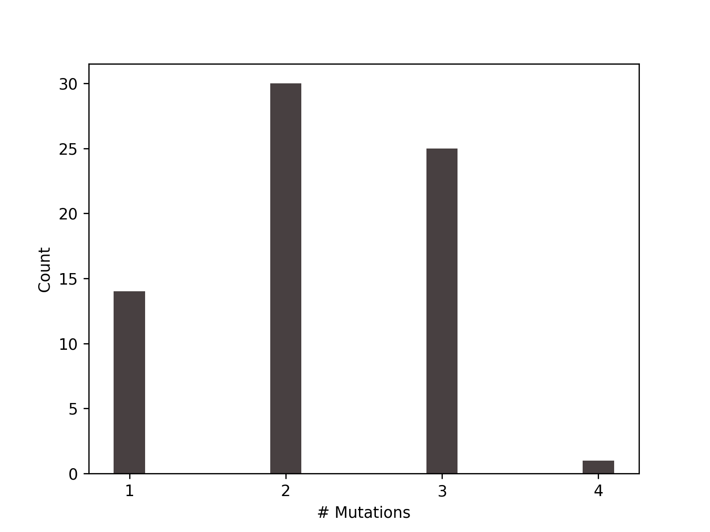

# HeIST
**He**miplasy **I**nference **S**imulation **T**ool


## Authors:
Matt Gibson (gibsomat@indiana.edu)  
Mark Hibbins (mhibbins@indiana.edu)

## Dependencies:
* [ms](http://home.uchicago.edu/~rhudson1/source.html)  
* [seq-gen](http://tree.bio.ed.ac.uk/software/seqgen/)
* biopython
* numpy
* matplotlib
* ete3


## Installation

```
git clone https://github.com/mhibbins/heist
cd heist
python setup.py install
```


## Usage
```
 _   _      ___ ____ _____
| | | | ___|_ _/ ___|_   _|
| |_| |/ _ \| |\___ \ | |
|  _  |  __/| | ___) || |
|_| |_|\___|___|____/ |_|
Hemiplasy Inference Simulation Tool
Version 0.3.0

Written by Mark Hibbins & Matt Gibson
Indiana University

usage: heist [-h] [-v] [-n] [-t] [-p] [-g] [-s] [-o] input

Tool for characterising hemiplasy given traits mapped onto a species tree

positional arguments:
  input                 Input NEXUS file

optional arguments:
  -h, --help            show this help message and exit
  -v, --verbose         Enable debugging messages to be displayed
  -n , --replicates     Number of replicates per batch
  -t , --threads        Number of threads for simulations
  -p , --mspath         Path to ms (if not in user path)
  -g , --seqgenpath     Path to seq-gen (if not in user path)
  -s , --mutationrate   Seq-gen mutation rate (default 0.05)
  -o , --outputdir      Output directory/prefix
```

## Input file

The input file is modified NEXUS format. A minimal example includes a tree (in newick format) and at least two dervived taxa set with the `set derived` command. If an outgroup is specified with `set outgroup`, the tree will be pruned to contain only taxa relevant to the simulation (i.e., the subclade containing derived taxa) + the outgroup. 

```
#NEXUS
begin trees;
	tree tree_1 = (spA:0.002,(spB:0.001,((spC:0.0004,spD:0.0008)10.0:0.0005,(spE:0.0006,spF:0.0004)8.0:0.0004)15:0.0009)90.0:0.005);
end;

begin hemiplasytool;
set derived taxon=spB
set derived taxon=spD
set derived taxon=spF
end;
```

### Species tree

Species tree in newick format. Branch lengths must be in average substitutions per site and **branches must be labeled with concordance factors**. [IQTree](www.iqtree.org/doc/Concordance-Factor) can be used to do this. 

> If your tree is already ultrametric and in coalescent units, you can supply this directly if you add the flag `set type coal` to the input file.

### Traits

Set which taxa have the derived character by using 

```
set derived taxon="species in tree"
```


### Introgression

Introgression events can be defined by using

```
set introgression source="species in tree" dest="species in tree" prob=[float_value] timing=[float_value]
```
Note that timing must be specified in coalescent units. For this reason, we recommend first running your input tree through [`subs2coal`](#subs2coal)

## Example:
```
python -m hemiplasytool -n 100000 -x 5 -p ~/msdir/ms -g ~/Seq-Gen-1.3.4/seq-gen -o test_w_introgression -v test/input_test_small_intro_v2.txt
```

### Output:
Three output files will be produced. The main output `test_w_introgression.txt`, a gene trees file `test_w_introgression.trees` which contains all observed topologies, and a mutation distribution plot `test_w_introgression.dist.png`.


```
### INPUT SUMMARY ###

Integer Code	Taxon Name
1:	sp1
2:	sp2
3:	sp3
4:	sp4
5:	sp5
6:	sp6

The species tree (smoothed, in coalescent units) is:
 (1:2.78984,(2:2.09238,((3:0.69746,4:0.69746)1:0.69746,(5:0.69746,6:0.69746)1:0.69746)1:0.69746)1:0.69746);

  _________________________________ 1
 |
_|        _________________________ 2*
 |       |
 |_______|                 ________ 3
         |         _______|
         |        |       |________ 4*
         |________|
                  |        ________ 5
                  |_______|
                          |________ 6*

3 taxa have the derived state: 2, 4, 6

With homoplasy only, 3 mutations are required to explain this trait pattern (Fitch parsimony)

Introgression from taxon 4 into taxon 6 occurs at time 0.3 with probability 0.05

5.00e+05 simulations performed

### RESULTS ###

70 loci matched the species character states

"True" hemiplasy (1 mutation) occurs 14 time(s)

Combinations of hemiplasy and homoplasy (1 < # mutations < 3) occur 30 time(s)

"True" homoplasy (>= 3 mutations) occurs 26 time(s)

70 loci have a discordant gene tree
0 loci are concordant with the species tree

4 loci originate from an introgressed history
66 loci originate from the species history

Distribution of mutation counts:

# Mutations	# Trees
On all trees:
1		14
2		30
3		25
4		1

On concordant trees:
# Mutations	# Trees

On discordant trees:
# Mutations	# Trees
1		14
2		30
3		25
4		1

Origins of mutations leading to observed character states for hemiplasy + homoplasy cases:

	Tip mutation	Internal branch mutation	Tip reversal
Taxa 2	3	27	0
Taxa 4	3	27	0
Taxa 6	0	30	0

### OBSERVED GENE TREES ###

                 _________________ 4
  ______________|
 |              | ________________ 3
 |              ||
 |               |         _______ 5
_|               |________|
 |                        |_______ 6*
 |
 |    _____________________________ 1
 |___|
     |_____________________________ 2

This topology occured 1 time(s)
                       ____________ 3
  ____________________|
 |                    |____________ 5
_|
 |         ________________________ 1
 |________|
          |     __________________ 2
          |____|
               |        __________ 4
               |_______|
                       |__________ 6*

This topology occured 4 time(s)
         _________________________ 2
  ______|
 |      |       __________________ 5
 |      |______|
 |             |   _______________ 4
_|             |__|
 |                |_______________ 6*
 |
 |  _______________________________ 1
 |_|
   |_______________________________ 3

...
```

See `test_w_introgression.txt.txt` for full output.




## Sub-modules

Once installed, two additional programs will be available at the command line: `newick2ms` and `subs2coal`.

### newick2ms

```
usage: newick2ms [-h] input

Tool for converting a newick string to ms-style splits. Note that this only
makes sense if the input tree is in coalescent units.

positional arguments:
  input       Input newick string file

optional arguments:
  -h, --help  show this help message and exit
```


### subs2coal

```
usage: subs2coal [-h] input

Tool for converting a newick string with branch lengths in subs/site to a
neewick string with branch lengths in coalescent units. Input requires gene or
site-concordancee factors as branch labels

positional arguments:
  input       Input newick string file

optional arguments:
  -h, --help  show this help message and exit
```

### heistMerge

```
usage: heistmerge [-h] [-d] [inputs [inputs ...]]

Merge output files from multiple HeiST runs. Useful for simulating large trees
by running multiple batch jobs.

positional arguments:
  inputs      Prefixes of output files to merge or a directory (supply -d flag
              as well)

optional arguments:
  -h, --help  show this help message and exit
  -d          Merge all files in a directory
```

`heistMerge` will write the merged output summary to standard out and create a new files `merged_trees.trees` which contains all observed focal gene trees.